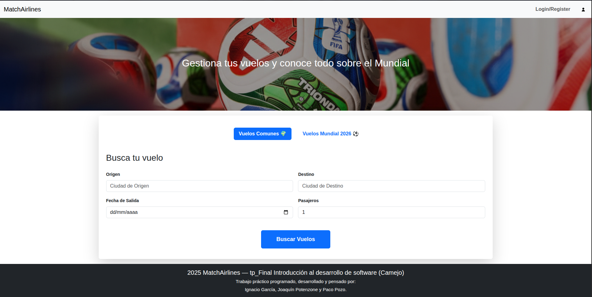
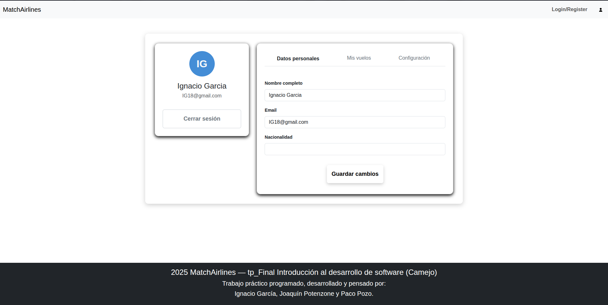
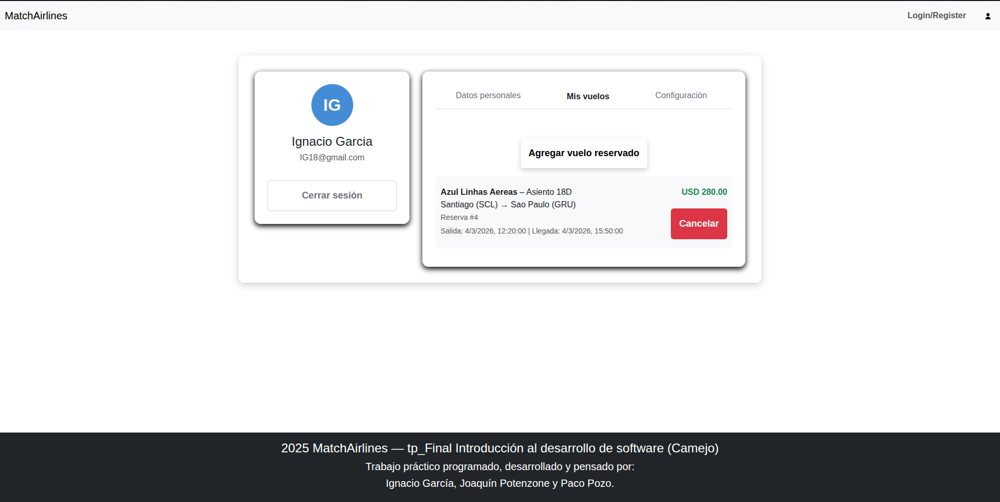
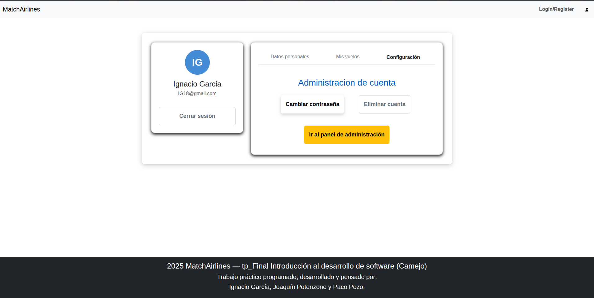
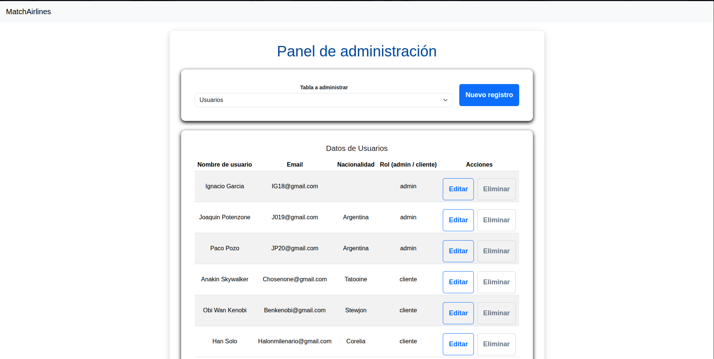

# tp-final_ids: 

#MatchAirlines – Seguimiento de vuelos Mundial 2026 
Este proyecto consiste en una aplicación web que permite realizar el seguimiento de vuelos relacionados con el Mundial 2026, conectando a los usuarios con información de vuelos, aeropuertos y estadios cercanos.

# Descripción general

MatchAirlines es una plataforma que permite a los usuarios:

- Realizar seguimiento de vuelos con origen o destino en los países sede del Mundial 2026 (**Estados Unidos, Canadá y México**).  
- Consultar vuelos que lleguen desde cualquier parte del mundo hacia dichos países.  
- Recibir información sobre estadios cercanos a los aeropuertos donde hayan aterrizado.  
- Interactuar mediante un perfil personal y recibir notificaciones de interés.  

La aplicación cuenta con una interfaz de administración (CRUD) donde los administradores pueden gestionar usuarios, vuelos, aeropuertos, aerolíneas y estadios.

# Entidades principales

-Usuarios: id_usuario, Correo, Nombre, Contrasenia, Fecha de creacion, ROL(admin/usuario) 
-Vuelos: id_vuelo, id_aerolinea(FK), id_aeropuerto_origen(FK), id_aeropuerto_destino(FK), Fecha de salida, capacidad, precio 
-Aeropuertos: id_aeropuerto, Nombre, Pais, Ciudad, Codigo IATA 
-Aerolinea: id_aerolinea,Nombre, Codigo IATA 
-Estadios: id_estadio, id_aeropuerto(FK), Nombre, Ciudad, Pais 
-Reservas: id_reserva, id_usuario(FK), id_vuelo(FK), asiento, Fecha reserva
-Partidos Mundial: id_partido, id_estadio(FK), Nombre equipos, Fecha partido 

# Páginas de la aplicación

# Home
- Presenta la bienvenida al sitio y la descripción del proyecto.  
- Muestra un buscador para filtrar vuelos por país, ciudad o aerolínea (tanto vuelos generales como particulares del mundial).  
- Incluye accesos directos al inicio de sesión y registro de usuario, como tambien a la pagina de perfil del mismo.  

# Perfil de usuario
- Posee 3 tabs las cuales muestran: Informacion del usuario, Vuelos reservados y Configuracion del perfil.
- Desde la tab de Datos personales se puede modificar el nombre del usuario, su correo y su nacionalidad.  
- Desde la tab de Mis vuelos, el usuario no solo podra cargar vuelos reservados a mano, sino que tambien apareceran aquellos que haya reservado desde la pagina de vuelos.  
- Desde la tab de Configuracion, se le permite al usuario modificar su contraseña como tambien eliminar su cuenta. Ademas de que si el usuario posee el rol de administrador, este tendra acceso al panel CRUD.
- Incluye opción de cerrar sesión.

# Seguimiento de vuelo
- Página principal de consulta de vuelos a la cual se accede luego del filtrado desde la pagina principal.  
- Figuraran en ella todo vuelo compatible con el filtrado previo.  
- Muestra detalles: origen, destino, fecha, aerolínea y precio.  
- Existe la opcion de modificar la busqueda en caso de que se desee hacer otra.  
- Opción para agregar el vuelo a la lista personal del usuario.

# Panel de administrador (CRUD)
- Acceso exclusivo para usuarios con rol admin.  
- Permite crear, leer, actualizar y eliminar (CRUD) registros de:
  - Usuarios  
  - Vuelos  
  - Aeropuertos  
  - Aerolíneas  
  - Estadios
  - Reservas
  - Partidos Mundial  

# Como Configurar y levantar el sistema: 
# Instalar dependencias
  -Ejecutar el comando make instalar
# Inicializar la base de datos
  -Ejecutar el comando make run (levanta el docker compose con postgres) y luego ejecutar el comando make levantar (inserta el archivo .sql)
# Levantar backend y frontend al mismo tiempo
  -Ejecutar el comando make start (levanta la db y el backend al mismo tiempo y ademas levanta el frontend)